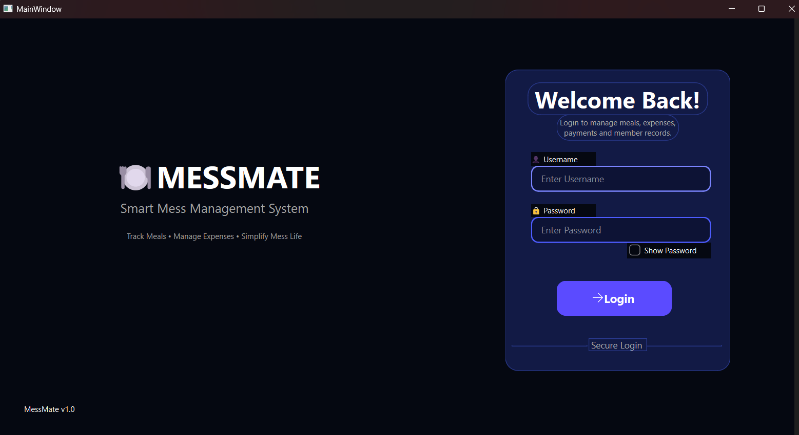
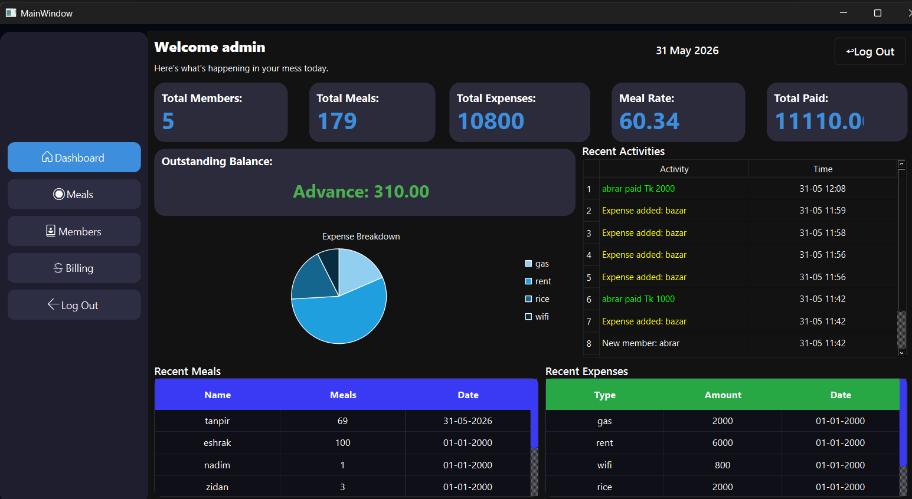
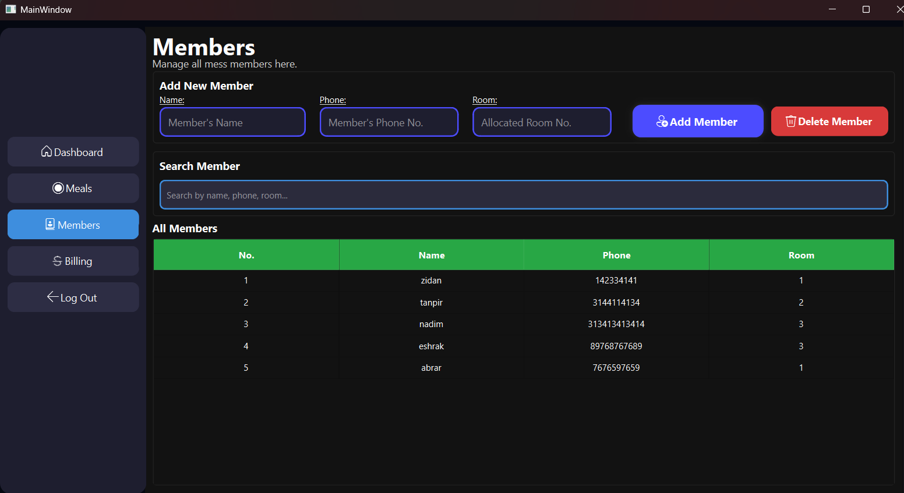
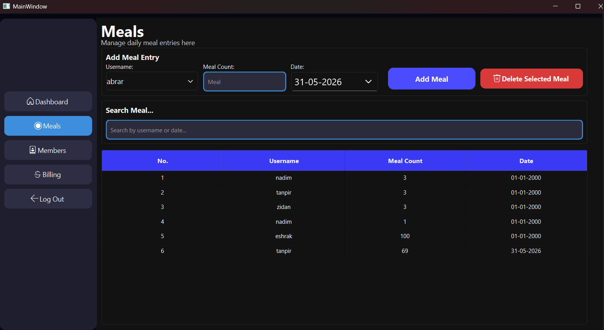
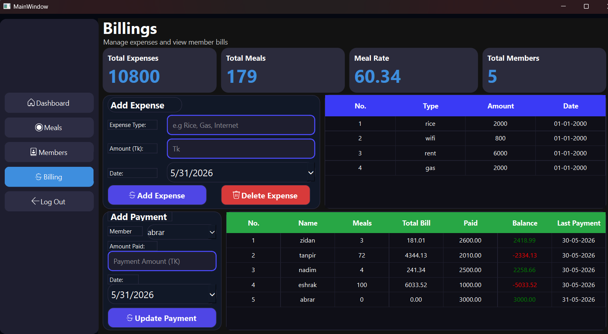

# MESSMATE

A Smart Mess Management System built with Qt6 and C++.

## Features

- Secure Login System
- Dashboard Overview
- Member Management
- Meal Tracking
- Expense Management
- Automatic Meal Rate Calculation
- Billing System
- Payment Tracking
- Expense Analytics Chart
- Recent Activity Log

## Technologies Used

- C++
- Qt 6
- SQLite
- Qt Charts

## Screenshots

### Login Page

### Dashboard

### Members

### Meals

### Billing

## Author

Developed by:
**Zidan**
Department of Computer Science & Engineering
